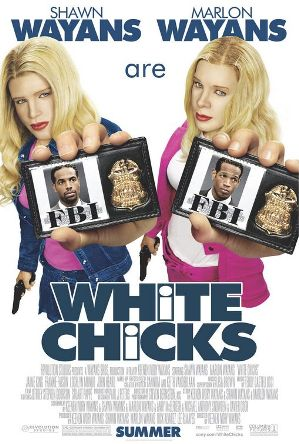

# task02-grupo09

## Integrantes

- Diuliano Vargas da Silveira - feat-adicionar-filmes-readme
- Mariana Silva Nascimento dos Reis
- Shaienne Oliveira dos Santos
- Ícaro Leon Santos Vieira
- Victor Yghor Simões dos Santos - feat-adicionar-filmes-readme, feat-adicionar-filmes-html
- André Miranda

## Filmes

### Frozen

#### Sinopse

Acompanhada por um vendedor de gelo, a jovem e destemida princesa Anna parte em uma jornada por perigosas montanhas de gelo na esperança de encontrar sua irmã, a rainha Elsa, e acabar com a terrível maldição de inverno eterno, que está provocando o congelamento do reino.

[Frozen](https://www.disneyplus.com/pt-br/movies/frozen-uma-aventura-congelante/4uKGzAJi3ROz)

### As Branquelas

#### Sinopse

Em As Branquelas, os irmãos Marcus (Marlon Wayans) e Kevin Copeland (Shawn Wayans) são detetives do FBI que estão com problemas no trabalho. A última investigação da dupla foi um grande fracasso e eles estão sob a ameaça de serem demitidos. Quando um plano para sequestrar as mimadas irmãs Brittany (Maitland Ward) e Tiffany Wilson (Anne Dudek) é descoberto, o caso é entregue aos principais rivais dos irmãos Copeland, os agentes Vincent Gomez (Eddie Velez) e Jack Harper (Lochlyn Munro). Para aumentar ainda mais a humilhação da dupla, eles são escalados para escoltar as jovens mimadas do aeroporto até o local de um evento pelo qual elas esperaram por meses. Porém no trajeto um acidente de carro provoca um verdadeiro desastre: enquanto uma das irmãs arranha o nariz, a outra corta o lábio. Desesperadas, elas se recusam a ir ao evento. É quando,para salvar o emprego, Marcus e Kevin decidem por assumir as identidades das irmãs.

[As Branquelas](https://www.netflix.com/title/60034587)

### Meninas Malvadas

#### Sinopse

A adolescente Cady Heron foi educada na África pelos seus pais cientistas. Quando sua família se muda para o subúrbio, nos Estados Unidos, Cady começa a frequentar a escola pública e recebe uma rápida introdução às leis de popularidade que dividem seus colegas. Sem querer, ela acaba no meio de um grupo de elite de estudantes apelidadas "as poderosas".

[Meninas Malvadas](https://globoplay.globo.com/meninas-malvadas/t/YhxN8dq7mD/)

### Shrek

#### Sinopse

Um ogro tem sua vida invadida por personagens de contos de fadas que acabam com a tranquilidade de seu lar. Ele faz um acordo pra resgatar uma princesa.

[Shrek](https://www.netflix.com/title/60020686)

### Eu sou a Lenda

#### Sinopse

Robert Neville é um brilhante cientista e o único sobrevivente de uma epidemia que transformou os humanos em mutantes sedentos por sangue. Andando pela cidade de Nova York, ele procura por outros possíveis sobreviventes e tenta achar a cura da praga usando seu próprio sangue, que é imune.

[Eu sou a Lenda](https://www.netflix.com/title/70060015)

### Os homens de preto

#### Sinopse

Os agentes K e J são policiais futuristas que trabalham em um projeto supersecreto do governo. Ele envolve a captura e deportação de seres espaciais não autorizados a ficarem na Terra.

[Os homens de preto](https://play.hbomax.com/page/urn:hbo:page:GYWe-bQ10eZEAXwEAAAAe:type:feature?source=googleHBOMAX&action=open)

### Mr Nobody

[Mr Nobody](https://www.primevideo.com/-/pt/detail/MR-NOBODY/0NYKXBILT6Z2GM96WPGZZ0V8L6)

#### Sinopse

Nemo, de 118 anos, conta a história de sua vida a um repórter. Na maior parte do tempo ele pensa que tem 34 anos, mas tudo fica confuso ao se concentrar em sua verdadeira idade. Nemo divide sua vida em três partes importantes.
